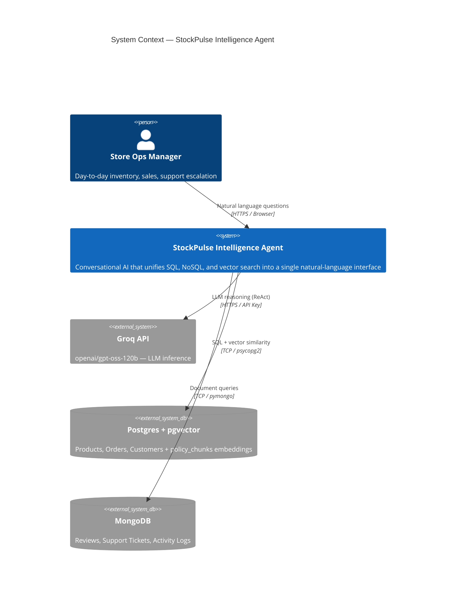
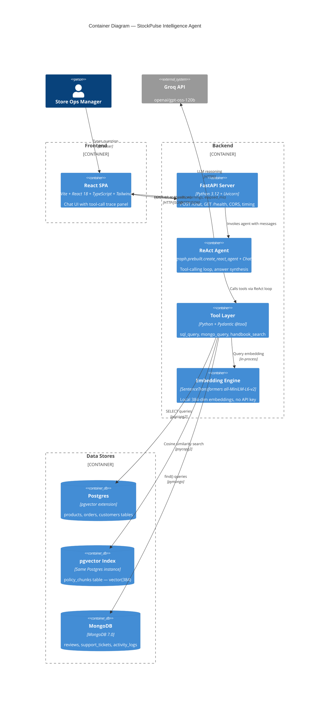
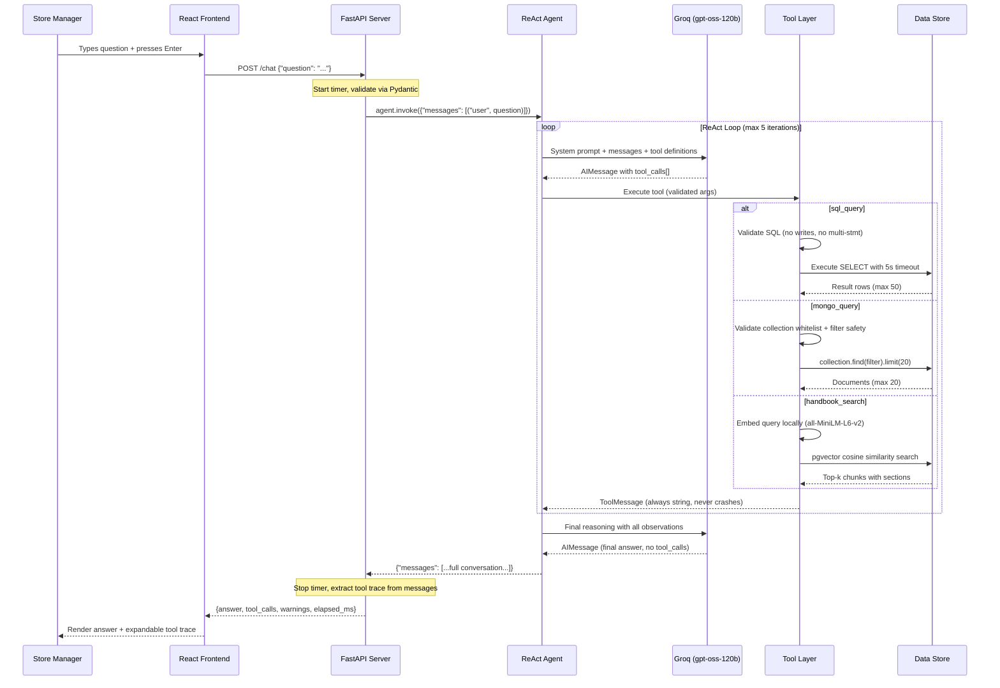
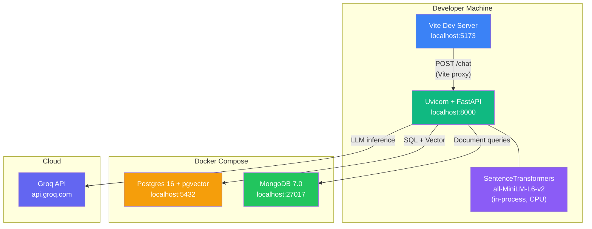
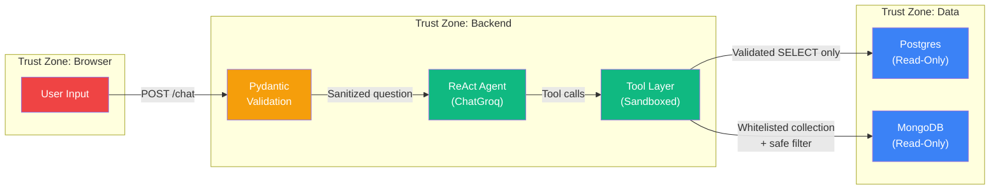

# StockPulse Store Intelligence Agent — System Architecture

> Multi-database conversational AI agent for e-commerce store operations.  
> One question in → grounded answer out, with the receipts.

---

## 1. System Context



**Note:** Embeddings are generated **locally** using SentenceTransformers (`all-MiniLM-L6-v2`, 384-dim). No external API call is needed for embedding.

---

## 2. Container Diagram



---

## 3. Single-Request Lifecycle



---

## 4. Deployment Topology



---

## 5. Security Boundaries



### Guardrail Summary

| Layer | Guardrail | Implementation |
|-------|-----------|----------------|
| HTTP | Max question length 1000 chars | Pydantic `Field(max_length=1000)` |
| SQL | 11 forbidden keywords (DROP, DELETE, UPDATE, INSERT, ALTER, TRUNCATE, GRANT, REVOKE, CREATE, EXEC, EXECUTE) | `_validate_sql()` regex check |
| SQL | Multi-statement injection | Semicolon splitting after strip |
| SQL | Runaway queries | Auto-LIMIT 50, `statement_timeout=5000ms` |
| Mongo | Collection whitelist | Only `reviews`, `support_tickets`, `activity_logs` |
| Mongo | NoSQL injection | Recursive `$where`, `$function`, `$accumulator` check |
| Mongo | Result cap | Hard limit 20 documents |
| RAG | Noise suppression | Similarity threshold (0.2) filters irrelevant chunks |
| RAG | Result cap | Max k=5 chunks |
| All tools | Crash prevention | Every tool returns a string — exceptions are caught |

---

## 6. Project Directory Structure

```
MultiDBAgent_class5_hw2_ManojKumarY/
│
├── SPEC.md                         # Specification (committed first)
├── README.md                       # Setup, architecture, decisions, findings
├── .env.example                    # Environment template (no secrets)
├── pyproject.toml                  # Python deps (uv)
├── docker-compose.yml              # Postgres (pgvector) + MongoDB containers
│
├── docs/
│   ├── ARCHITECTURE.md             # This file
│   ├── HLD.md                      # High-Level Design
│   └── LLD.md                      # Low-Level Design
│
├── backend/
│   ├── __init__.py
│   ├── config.py                   # Pydantic Settings (Groq key, DB URLs, limits)
│   ├── main.py                     # FastAPI app, POST /chat, GET /health
│   ├── agent.py                    # create_react_agent + ChatGroq + system prompt
│   └── tools/
│       ├── __init__.py
│       ├── sql_tool.py             # Read-only SQL with guardrails
│       ├── mongo_tool.py           # Whitelisted MongoDB queries
│       └── rag_tool.py             # SentenceTransformer + pgvector search
│
├── scripts/
│   ├── seed_postgres.py            # Products, customers, orders
│   ├── seed_mongo.py               # Reviews, support_tickets, activity_logs
│   └── index_policies.py           # Chunk + embed policies → policy_chunks
│
├── policies/
│   ├── return_refund.md
│   ├── shipping.md
│   └── discounts.md
│
├── frontend/
│   ├── index.html
│   ├── package.json
│   ├── tsconfig.json
│   ├── tailwind.config.js
│   ├── postcss.config.js
│   ├── vite.config.ts              # Dev proxy /chat → localhost:8000
│   └── src/
│       ├── main.tsx
│       ├── App.tsx                  # Full chat UI, message history, suggestions
│       ├── index.css
│       ├── api/
│       │   └── chat.ts             # POST /chat API client
│       ├── components/
│       │   ├── ToolTrace.tsx        # Expandable tool-call trace panel
│       │   └── WarningBanner.tsx    # Amber guardrail warning badges
│       └── types/
│           └── index.ts            # TypeScript interfaces matching API contract
│
└── tests/
    ├── __init__.py
    ├── conftest.py                  # Shared fixtures (env-based skip logic)
    ├── unit/
    │   ├── __init__.py
    │   ├── test_sql_tool.py         # 11 tests: validation, LIMIT, mocked DB
    │   ├── test_mongo_tool.py       # 9 tests: whitelist, injection, cap
    │   └── test_rag_tool.py         # 9 tests: embedding, threshold, errors
    └── e2e/
        ├── __init__.py
        └── test_agent_e2e.py        # 5 acceptance + 1 failure + 4 contract
```

---

## 7. Key Architectural Decisions

| # | Decision | Choice | Rationale |
|---|----------|--------|-----------|
| 1 | Agent never touches DB directly | Tools are the only data interface | Enforces ReAct pattern. Agent sees string results, never connection objects. Prevents prompt-injection escalation. |
| 2 | Tools always return strings | Even on error, tools return a descriptive string | Prevents the ReAct loop from crashing. Agent reasons about errors gracefully. |
| 3 | LLM: Groq API | `openai/gpt-oss-120b` via `ChatGroq` | Sub-second first-token latency. Strong ReAct instruction following. Swappable via `LLM_MODEL` in `.env`. |
| 4 | Embeddings: local SentenceTransformers | `all-MiniLM-L6-v2` (384-dim, CPU) | Eliminates external API dependency for embeddings. 90 MB model, zero cost per query. |
| 5 | pgvector in same Postgres | Policy chunks alongside transactional data | Single DB instance simplifies ops. No separate vector DB needed at this scale (<100 chunks). |
| 6 | Single `/chat` endpoint | No REST resources, no CRUD | The agent IS the API. One question in, one grounded answer out. |
| 7 | Pydantic everywhere | Tool args, HTTP request/response, config | Type safety from HTTP boundary to tool invocation. Validation errors surface before any DB call. |
| 8 | Vector dimension: 384 | Matches `all-MiniLM-L6-v2` output | DDL uses `vector(384)`. If embedding model changes, re-run `index_policies.py`. |

---

*Component-level design → [HLD.md](./HLD.md) · Implementation contracts → [LLD.md](./LLD.md)*
