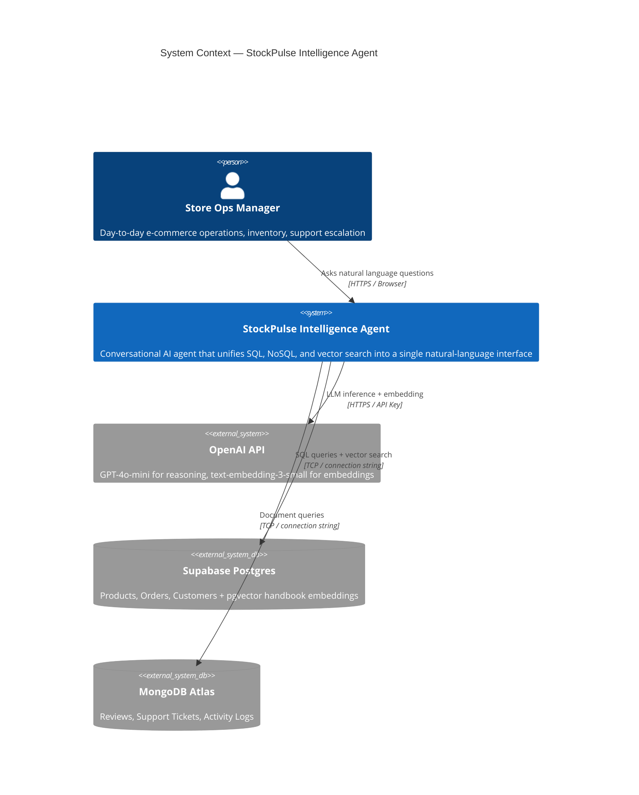
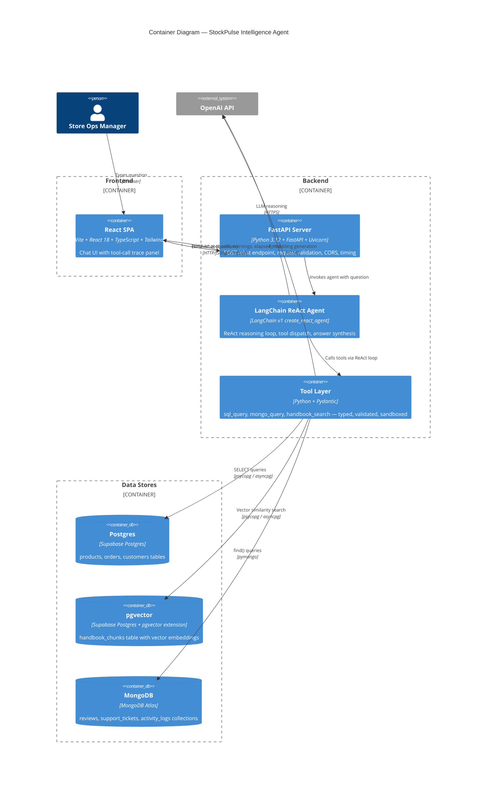
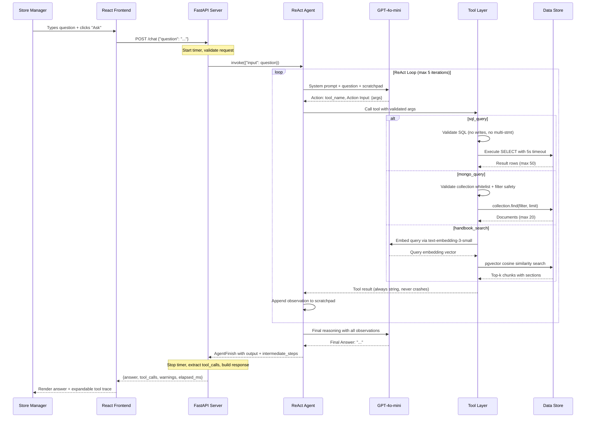
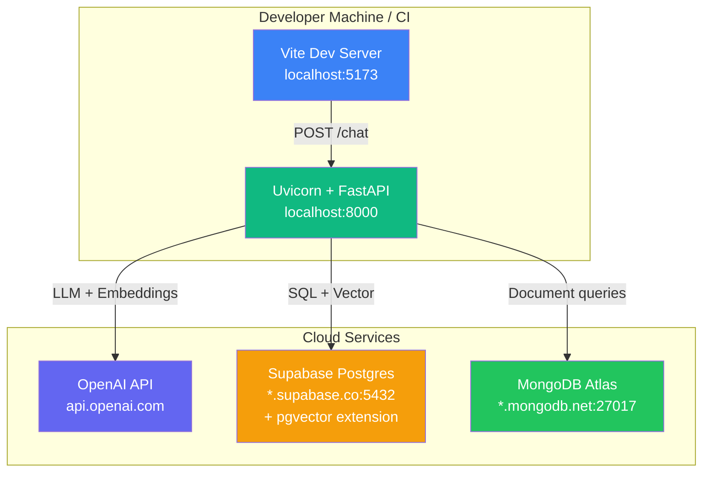
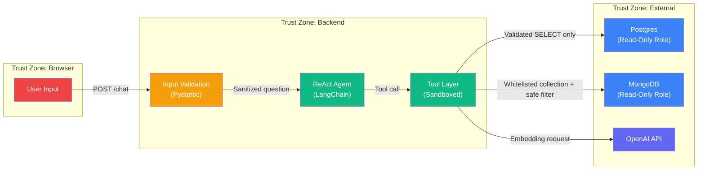

# StockPulse Store Intelligence Agent — System Architecture

> Enterprise-grade multi-database conversational agent for e-commerce operations intelligence.

---

## 1. System Context Diagram



---

## 2. Container Diagram



---

## 3. Data Flow — Single Request Lifecycle



---

## 4. Deployment Topology



---

## 5. Security Boundary Map



---

## 6. Project Directory Structure

```
MultiDBAgent_class5_hw2_ManojKumarY/
│
├── SPEC.md                          # Specification (committed first)
├── README.md                        # Setup, architecture, decisions, findings
├── .env.example                     # Required environment variables (no secrets)
├── pyproject.toml                   # Python project config (uv)
│
├── docs/
│   ├── ARCHITECTURE.md              # This file — system architecture
│   ├── HLD.md                       # High-Level Design
│   └── LLD.md                       # Low-Level Design
│
├── backend/
│   ├── __init__.py
│   ├── config.py
│   ├── main.py
│   ├── agent.py
│   └── tools/
│       ├── sql_tool.py
│       ├── mongo_tool.py
│       └── rag_tool.py
├── scripts/
│   ├── seed_postgres.py
│   ├── seed_mongo.py
│   └── index_policies.py
├── policies/
│   ├── return_refund.md
│   ├── shipping.md
│   └── discounts.md
│
├── frontend/
│   ├── index.html
│   ├── package.json
│   ├── tsconfig.json
│   ├── tailwind.config.js
│   ├── vite.config.ts
│   └── src/
│       ├── main.tsx
│       ├── App.tsx
│       ├── api/
│       │   └── chat.ts              # POST /chat API client
│       ├── components/
│       │   ├── ChatWindow.tsx
│       │   ├── MessageBubble.tsx
│       │   ├── ToolTrace.tsx         # Expandable tool-call trace panel
│       │   ├── InputBar.tsx
│       │   └── WarningBanner.tsx
│       └── types/
│           └── index.ts             # TypeScript interfaces matching API contract
│
└── tests/
    ├── conftest.py                  # Shared fixtures (DB connections, mock LLM)
    ├── unit/
    │   ├── test_sql_tool.py
    │   ├── test_mongo_tool.py
    │   └── test_rag_tool.py
    ├── integration/
    │   ├── test_sql_integration.py
    │   ├── test_mongo_integration.py
    │   └── test_rag_integration.py
    └── e2e/
        └── test_agent_e2e.py
```

---

## 7. Key Architectural Decisions

| Decision | Choice | Rationale |
|----------|--------|-----------|
| Agent never touches DB directly | Tools are the only data interface | Enforces the ReAct pattern. Agent receives string results, never connection objects. Prevents prompt-injection from escalating to data-level access. |
| Tools always return strings | Even on error, tools return a descriptive string | Prevents the ReAct loop from crashing on exceptions. The agent can reason about errors gracefully. |
| Read-only database roles | Postgres and MongoDB connections use read-only credentials | Defense-in-depth. Even if SQL validation is bypassed, the DB role cannot write. |
| pgvector in Supabase Postgres | Handbook embeddings stored alongside transactional data | Single Postgres instance simplifies ops. pgvector extension is natively supported on Supabase. No separate vector DB needed for this scale. |
| Single `/chat` endpoint | No REST resources, no CRUD | The agent is the API. One question in, one grounded answer out. Matches the assignment requirement and keeps the interface simple. |
| Pydantic everywhere | Tool args, API request/response, config | Type safety from the HTTP boundary to the tool invocation. Validation errors surface before any database call. |

---

*This document is the bird's-eye view. For component-level design, see [HLD.md](./HLD.md). For implementation-level contracts, see [LLD.md](./LLD.md).*
