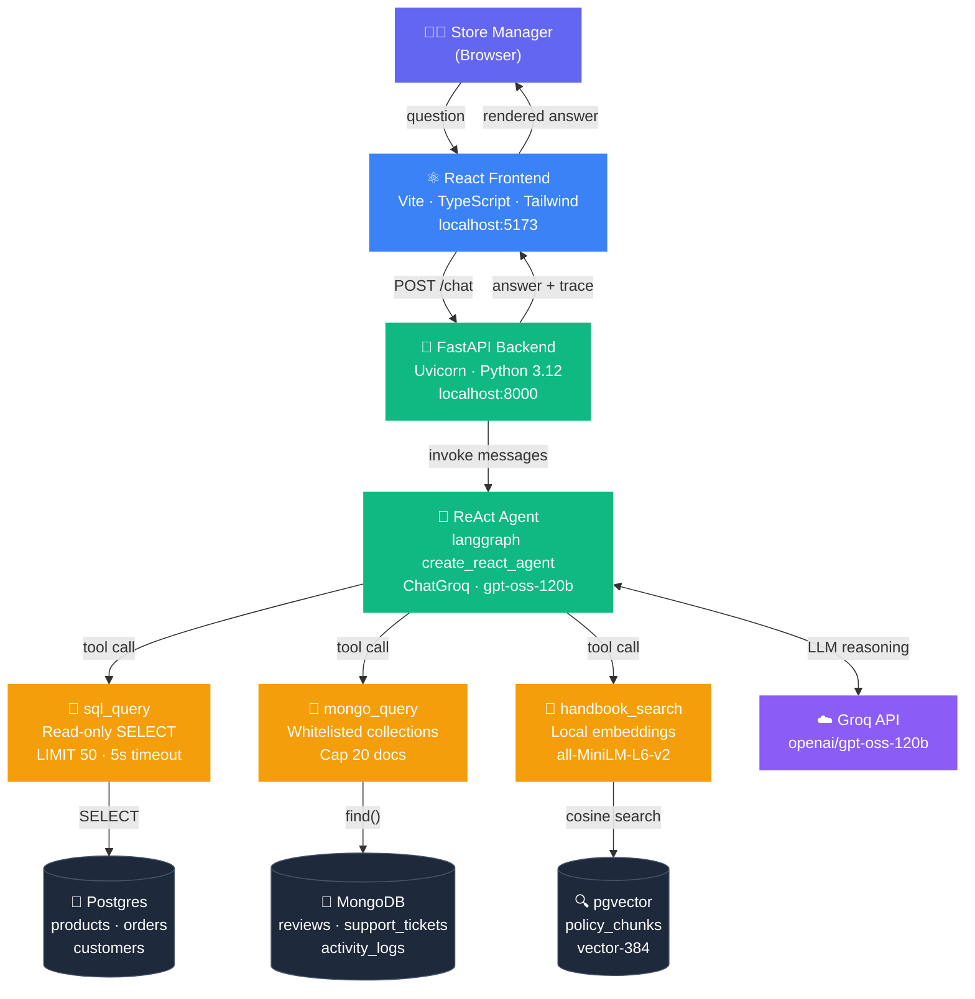
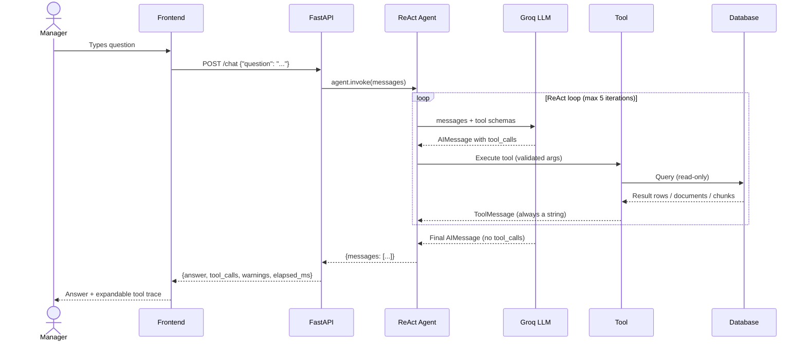
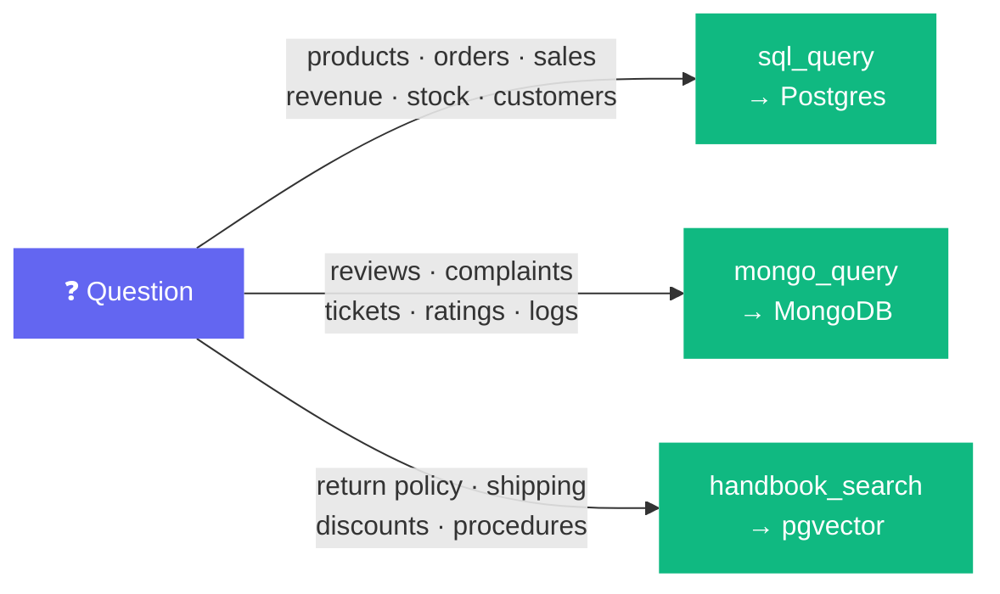
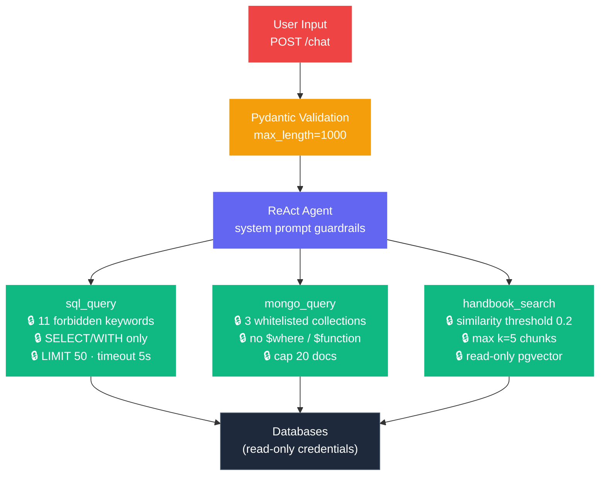

# StockPulse Store Intelligence Agent — Architecture

> Multi-database conversational AI agent for e-commerce store operations.
> One question in → grounded answer out, with full tool-call receipts.

---

## 1. System Overview



---

## 2. Request Lifecycle



---

## 3. Tool Routing



---

## 4. Security Layers



---

## 5. Project Structure

```
MultiDBAgent_class5_hw2_ManojKumarY/
│
├── SPEC.md                      # Specification (committed first)
├── README.md                    # Setup, decisions, findings
├── .env.example                 # Environment template (no secrets)
├── pyproject.toml               # Python dependencies (uv)
├── docker-compose.yml           # Postgres (pgvector) + MongoDB
│
├── docs/
│   ├── ARCHITECTURE.md          # ← this file
│   ├── HLD.md                   # Component design
│   └── LLD.md                   # Implementation contracts
│
├── backend/
│   ├── config.py                # Pydantic Settings — keys, limits
│   ├── main.py                  # FastAPI: POST /chat, GET /health
│   ├── agent.py                 # create_react_agent + ChatGroq + prompt
│   └── tools/
│       ├── sql_tool.py          # Read-only SQL with guardrails
│       ├── mongo_tool.py        # Whitelisted MongoDB queries
│       └── rag_tool.py          # SentenceTransformer + pgvector
│
├── scripts/
│   ├── seed_postgres.py         # products, customers, orders
│   ├── seed_mongo.py            # reviews, tickets, logs
│   └── index_policies.py        # chunk → embed → policy_chunks
│
├── policies/
│   ├── return_refund.md
│   ├── shipping.md
│   └── discounts.md
│
├── frontend/
│   ├── vite.config.ts           # Dev proxy /chat → :8000
│   └── src/
│       ├── App.tsx              # Chat UI + suggestions
│       ├── api/chat.ts          # POST /chat client
│       ├── components/
│       │   ├── ToolTrace.tsx    # Expandable tool-call panel
│       │   └── WarningBanner.tsx
│       └── types/index.ts       # TypeScript ↔ API contract
│
└── tests/
    ├── unit/                    # Mocked — no live DB needed
    │   ├── test_sql_tool.py     # 11 tests
    │   ├── test_mongo_tool.py   # 9 tests
    │   └── test_rag_tool.py     # 9 tests
    └── e2e/
        └── test_agent_e2e.py    # 5 acceptance + 1 failure case
```

---

## 6. Key Design Decisions

| Decision | Choice | Rationale |
|----------|--------|-----------|
| Agent never touches DB | Tools are the only data interface | Prevents prompt-injection from escalating to data access |
| Tools always return strings | Errors returned as strings, not raised | ReAct loop never crashes; agent reasons about failures |
| LLM: Groq | `openai/gpt-oss-120b` via `ChatGroq` | Sub-second latency; swappable via `LLM_MODEL` in `.env` |
| Embeddings: local | `all-MiniLM-L6-v2` · 384-dim · CPU | Zero API cost, zero extra dependency, 90 MB one-time download |
| pgvector in Postgres | `policy_chunks` alongside transactional tables | Single DB, single backup, no separate vector store needed |
| Single `/chat` endpoint | No REST resources | The agent IS the API — one question, one grounded answer |

---

*Component design → [HLD.md](./HLD.md) · Implementation contracts → [LLD.md](./LLD.md)*
